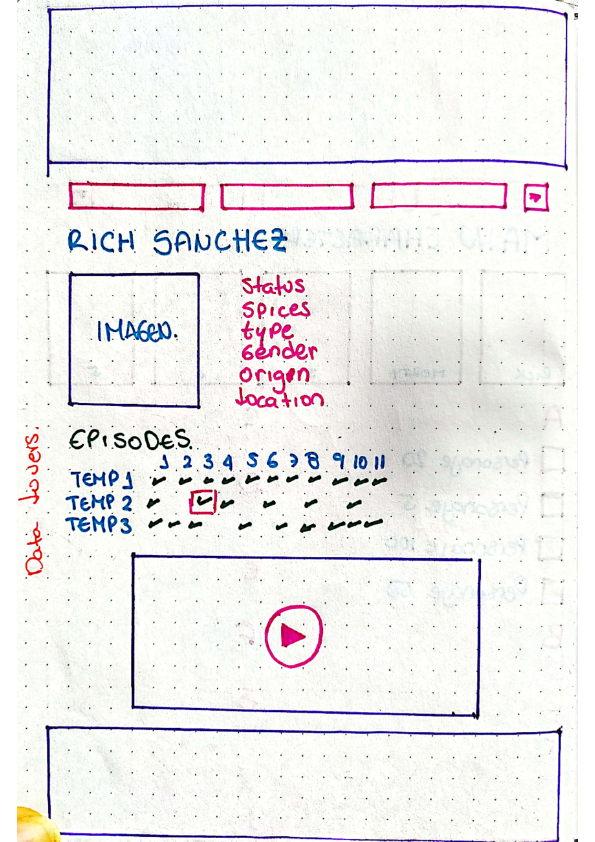
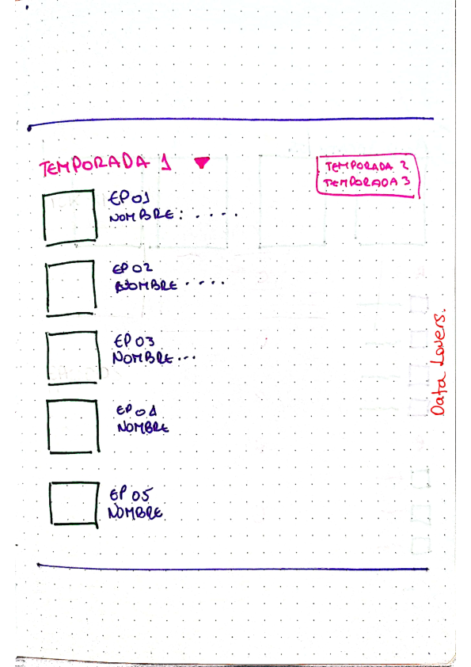
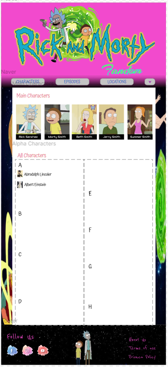
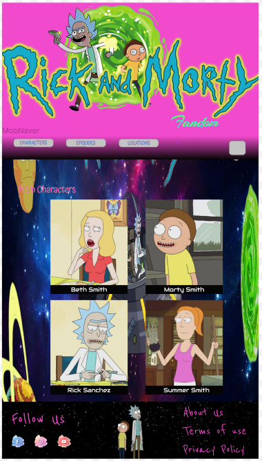
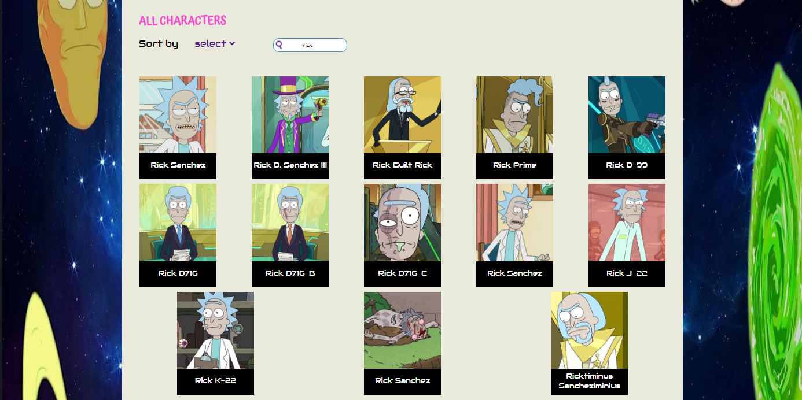
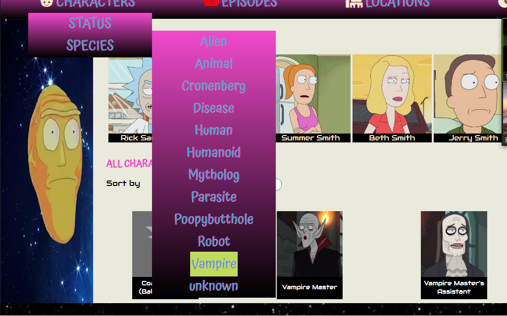

## Índice

* [1. Definición del producto](#1-Definición-del-producto)
* [2. Historias de usuario](#2-Historias-de-usuario)
* [3. Diseño de la Interfaz de usuario](#3-Diseño-de-la-Interfaz-de-Usuario)
* [4. Objetivos de aprendezaje](#4-Objetivos-de-aprendizaje)
* [5. Checklist](#5-checklist)

***

# 1. Definición del producto

Aplicación web con adaptabilidad movil, creada para usuarios nuevos y conocedores de la serie Rick and Morty, 
donde podran encontran todos los personajes de la serie hasta la tercer temporada, saber sí aún siguen vivos en la 
serie y muchos detalles más.
Buscamos destacar los objetivos mas comunes de los usuarios al hacer uso de este tipo de fanpage, entregando un MVP
en una interfaz intuituva y facil de usar.

# 2. Historias de usuario

  1. Yo como usuario "Fan de la serie Rick and Morty" quiero visualizar una lista de los personajes para conocer sus características principales
  2. Yo como usuario "Fan de la serie Rick and Morty" quiero filtrar por nombre del personaje Alfabeticamente para poder encontrarlo mas rápido en el listado.
  3. Yo como usuario "Fan de la serie Rick and Morty" quiero filtrar por estado de vida del personaje (vivo, muerto) para saber si seguirá apareciendo en los próximos episodios.
  4. Yo como usuario "Fan de la serie Rick and Morty" quiero filtrar por especie, para conocer que tipos de seres tiene la serie.
  5. Yo como usuario "Fan de la serie Rick and Morty" quiero ver datos estadísticos de la serie para conocer generalidades de la misma.

# 3. Diseño de la Interfaz de Usuario

## 1. Prototipo de baja fidelidad

## 2. Prototipo de alta fidelidad

 

## 3. Testeos de usabilidad

## 4. Diseño final

[

### Problemas detectados con el test de usabilidad

* Al cerrar el popup con la información del personaje, se muestra el encabezado de la pagina, en vez de continuar en la ubicación del personaje que se selecciono.
* Los submenus no mantenian su posición, cuando se cambiaba de tamaño de pantalla.
* La imagen del encabezado se veia muy alargada, dande una apariencia aplastada.
* El nombre que se muestra en la tarjeta de cada personaje, variaba su tamaño dependiendo de longevidad del nombre, haciendo ver dispares las cajas que contenian esos literales.

# 4. Objetivos de aprendizaje

El objetivo principal de este proyecto es que aprendas a diseñar y construir una
interfaz web donde se pueda visualizar y manipular data, entendiendo lo que el
usuario necesita.

### HTML y CSS

* [x] [Uso de HTML semántico.](https://developer.mozilla.org/en-US/docs/Glossary/Semantics#Semantics_in_HTML)
* [x] Uso de selectores de CSS.
* [x] Construir tu aplicación respetando el diseño realizado (maquetación).
* [x] [Uso de flexbox en CSS.](https://css-tricks.com/snippets/css/a-guide-to-flexbox/)

### DOM y Web APIs

* [x] Uso de selectores del DOM.
* [x] Manejo de eventos del DOM.
* [X] [Manipulación dinámica del DOM.](https://developer.mozilla.org/es/docs/Referencia_DOM_de_Gecko/Introducci%C3%B3n)
(appendChild |createElement | createTextNode| innerHTML | textContent | etc.)

### JavaScript

* [x] Uso de condicionales (if-else | switch | operador ternario)
* [x] Uso de bucles (for | for..in | for..of | while)
* [x] Uso de funciones (parámetros | argumentos | valor de retorno)
* [x] Manipular arrays (filter | map | sort | reduce)
* [x] Manipular objects (key | value)
* [x] Uso ES modules ([`import`](https://developer.mozilla.org/en-US/docs/Web/JavaScript/Reference/Statements/import)
| [`export`](https://developer.mozilla.org/en-US/docs/Web/JavaScript/Reference/Statements/export))
* [x] Diferenciar entre expression y statements.
* [x] Diferenciar entre tipos de datos atómicos y estructurados.

### Testing

* [X] [Testeo unitario.](https://jestjs.io/docs/es-ES/getting-started)

### Estructura del código y guía de estilo

* [x] Organizar y dividir el código en módulos (Modularización)
* [x] Uso de identificadores descriptivos (Nomenclatura | Semántica)
* [x] Uso de linter (ESLINT)

### Git y GitHub

* [x] Uso de comandos de git (add | commit | pull | status | push)
* [x] Manejo de repositorios de GitHub (clone | fork | gh-pages)
* [x] Colaboración en Github (branches | pull requests | |tags)

### UX

* [x] Diseñar la aplicación pensando y entendiendo al usuario.
* [x] Crear prototipos para obtener feedback e iterar.
* [x] Aplicar los principios de diseño visual (contraste, alineación, jerarquía)
* [x] Planear y ejecutar tests de usabilidad.

# 5. Checklist

* [x] Usa VanillaJS.
* [x] No hace uso de `this`.
* [x] Pasa linter (`npm run pretest`)
* [x] Pasa tests (`npm test`)
* [x] Pruebas unitarias cubren un mínimo del 70% de statements, functions y
  lines y branches.
* [x] Incluye _Definición del producto_ clara e informativa en `README.md`.
* [x] Incluye historias de usuario en `README.md`.
* [x] Incluye _sketch_ de la solución (prototipo de baja fidelidad) en
  `README.md`.
* [x] Incluye _Diseño de la Interfaz de Usuario_ (prototipo de alta fidelidad)
  en `README.md`.
* [x] Incluye link a Zeplin o Figma en `README.md`.
* [x] Incluye el listado de problemas que detectaste a través de tests de
  usabilidad en el `README.md`.
* [x] UI: Muestra lista y/o tabla con datos y/o indicadores.
* [x] UI: Permite ordenar data por uno o más campos (asc y desc).
* [x] UI: Permite filtrar data en base a una condición.
* [x] UI: Es _responsive_.
